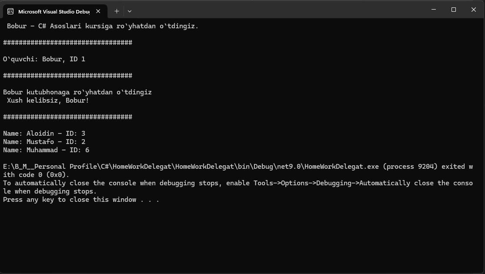

# Delegatlar bilan ishlash (C#)

## Maqsad : Ushbu loyiha orqali quyidagi C# konseptlarini amalda mustahkamlash maqsad qilingan:

- Custom (o'zgaruvchan) delegatlar

- Action va Func turlari bilan ishlash

- Ko'p parametrli delegatlar

- Multicast delegatlar

- Predicate orqali filtrlash

## Loyiha tuzilmasi:

#### HomeWorkDelegat /

#### Models/

- Student.cs
- Course.cs

Service/

- CourseService.cs
- LibraryService.cs
- FormatterService.cs

Program.cs

HomeWorkDelegat.csproj

1. Custom Delegat bilan ishlash:
2. Func<Student, string> bilan ishlash:
3. Multicast Delegat (Action):
4. Bonus: Predicate bilan filtrlash:

### Natija:

