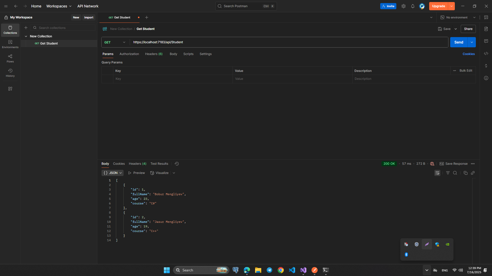
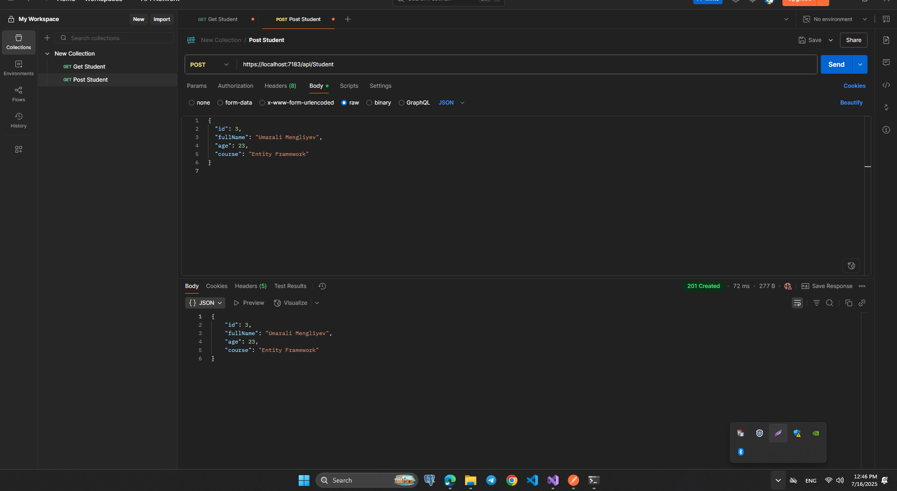
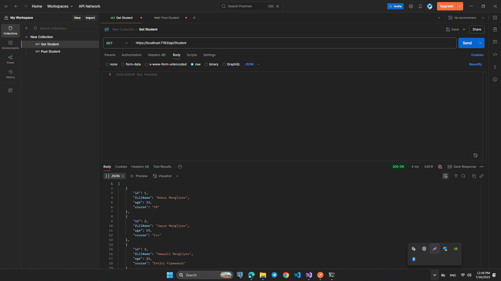
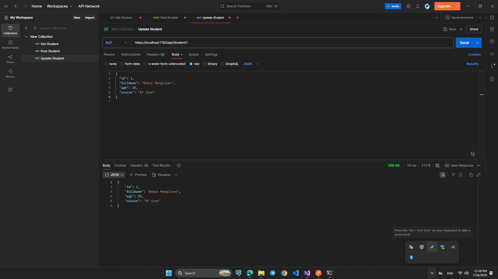
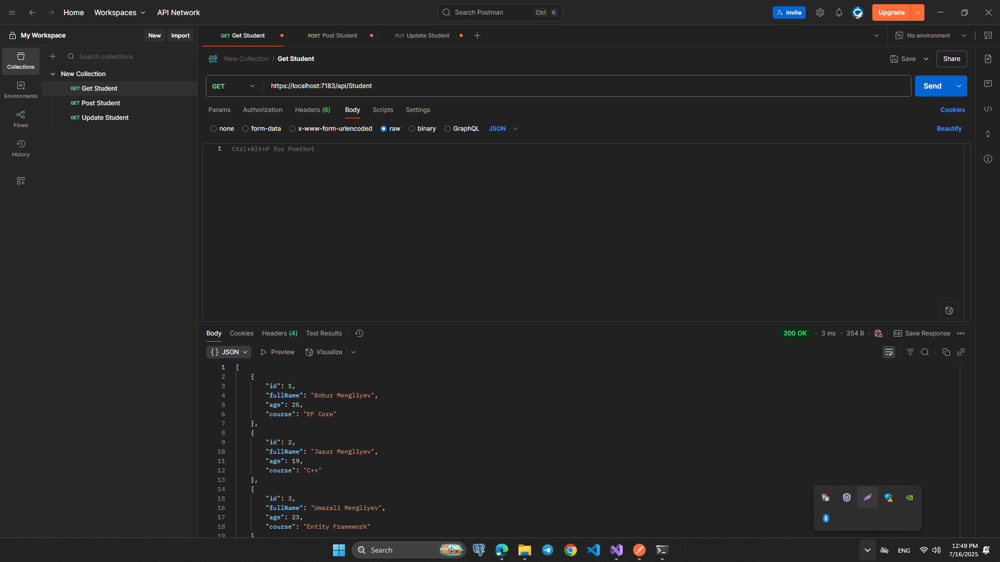
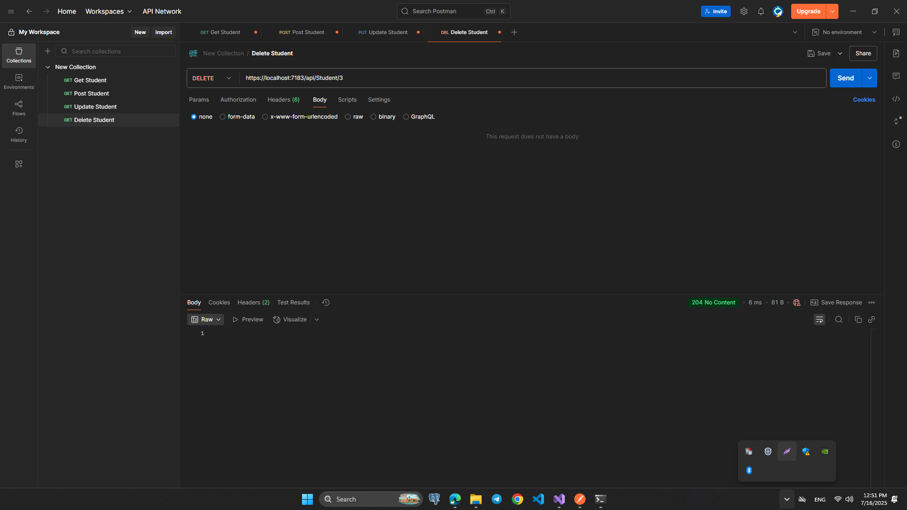
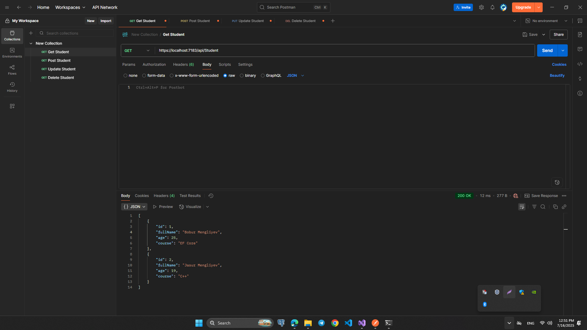

# HomeWork 2: Student API — ASP.NET Core Web API

## 📁 Loyiha Tuzilishi

MyFirstAppTest/

├── Controllers/

│ └── StudentController.cs → API endpoint'lar

├── Data/

│ └── FakeDb.cs → Xotiraviy student list

├── Models/

│ └── Student.cs → Student modeli

├── Program.cs → Ilovani ishga tushirish

└── MyFirstAppTest.csproj

## 1. GET – Barcha studentlar:

## 2. POST – Yangi student qo`shish:

## Buyruqdan keyingi holat:

## 3. PUT – Student ma`lumotini yangilash:

## Buyruqdan keyingi holat:

## 4. DELETE – Student o`chirish:

## Buyruqdan keyingi holat:

