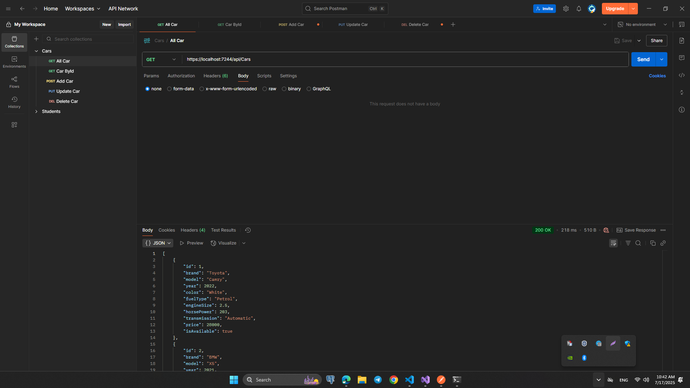
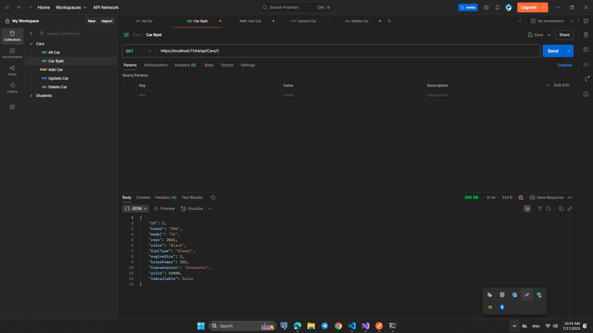
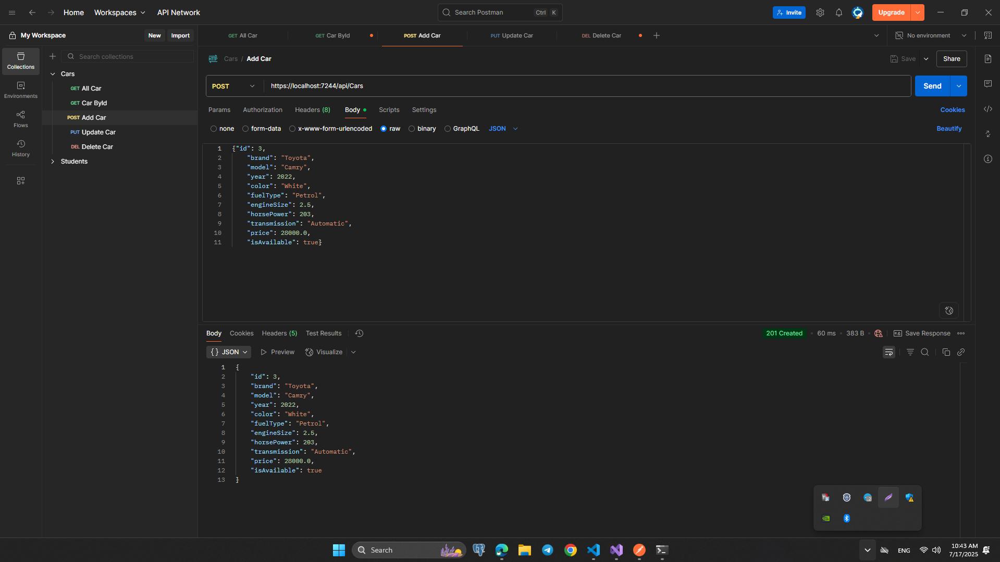
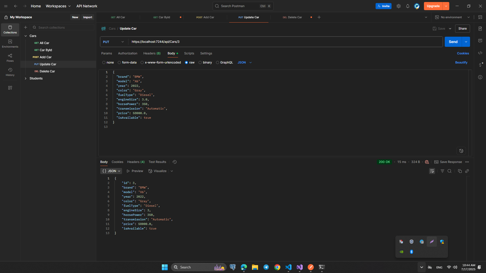
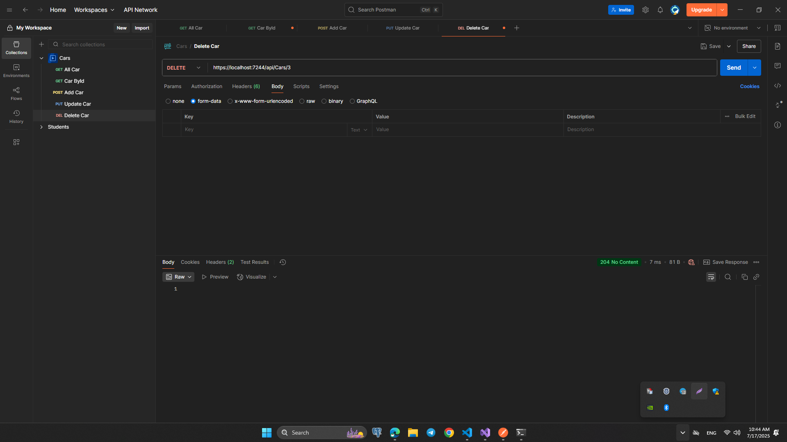

# HomeWork 2: CarApp API — ASP.NET Core Web API

## 📋 Loyihaning qisqacha tavsifi:

CarApp — bu ASP.NET Core yordamida yozilgan oddiy RESTful Web API bo'lib, unda avtomobillar haqidagi ma'lumotlarni yaratish, ko'rish, yangilash va o'chirish (CRUD) funksiyalari mavjud. Hozircha ma'lumotlar in-memory ro‘yxatda `(List<Car>)` saqlanadi.

## 📂 Endpointlar:

- GET /api/cars
  Barcha mashinalarni ro‘yxatini qaytaradi.

- GET /api/cars/{id}
  Belgilangan id bo‘yicha mashina ma’lumotini qaytaradi.

- POST /api/cars
  Yangi mashina qo‘shadi. JSON formatda Car obyektini yuborish kerak.

- PUT /api/cars/{id}
  Mavjud mashina ma’lumotlarini to‘liq yangilaydi.

- DELETE /api/cars/{id}
  Mashinani id bo‘yicha o‘chiradi.

## 🖼️ API Preview:

- GET /api/cars:

- GET /api/cars/{id}:

- POST /api/cars:

- PUT /api/cars/{id}:

- DELETE /api/cars/{id}:

