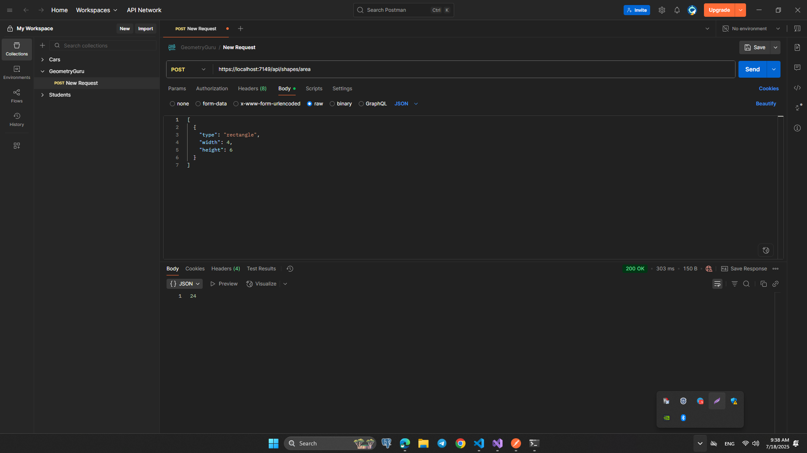
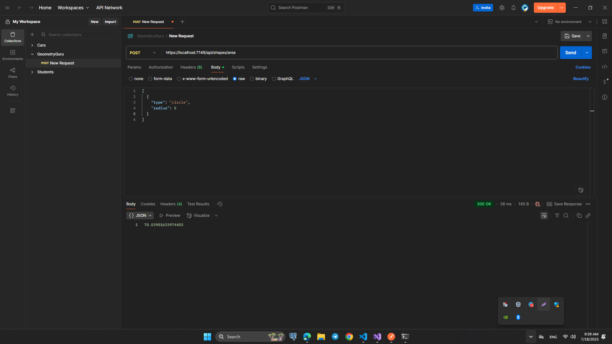
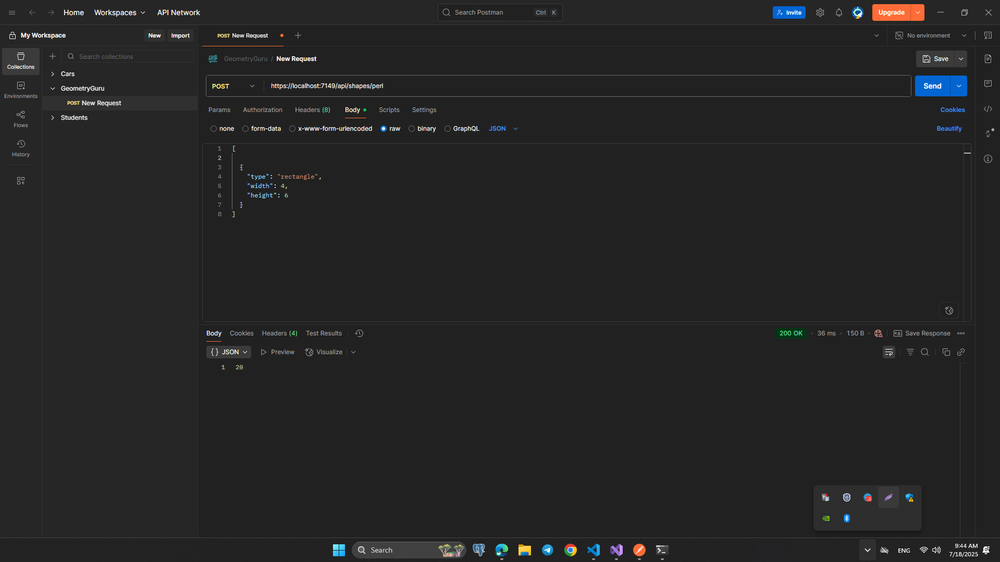

# HomeWork 4:

## GeometryGuruAsync Calculator: Web API + Console App

# Texnologiyalar:

- ASP.NET Core Web API
- C# OOP: Abstraction, Inheritance, Polymorphism
- Async/await

## Loyiha Tuzilishi:

### Controllers/

- ShapesController.cs

### Models/

- Shape.cs (abstract)
- Circle.cs
- Rectangle.cs
- ShapeDto.cs

### Services/

- GeometryService.cs
- IGeometryService.cs

Program.cs

## API orqali natijalar (Postman orqali)

### To'g'ri to'rtburchak (Rectangle) yuzasini hisoblash: `https://localhost:7149/api/shapes/area`

### Aylana (Circle) yuzasini hisoblash:

### To'g'ri to'rtburchak (Rectangle) perimetrini hisoblash: `https://localhost:7149/api/shapes/peri`

### Aylana (Circle) perimetrini hisoblash:

