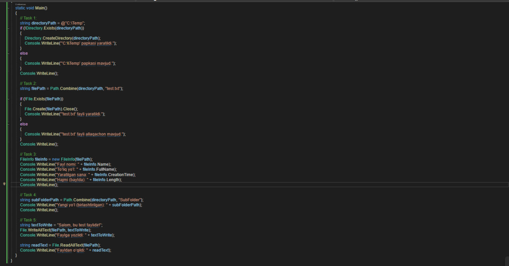
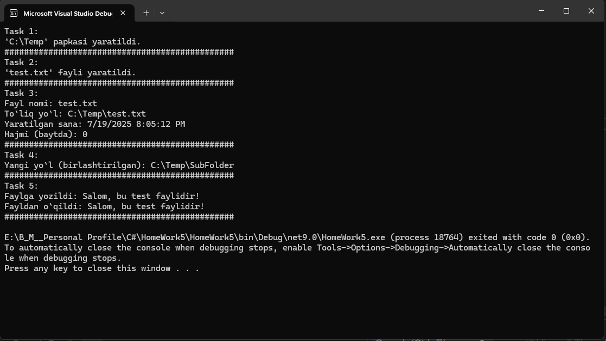
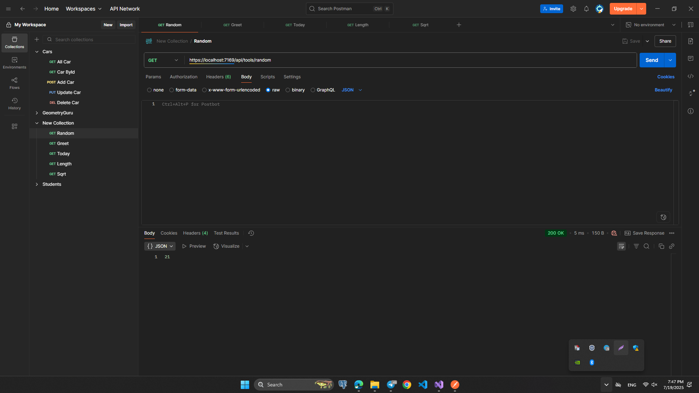
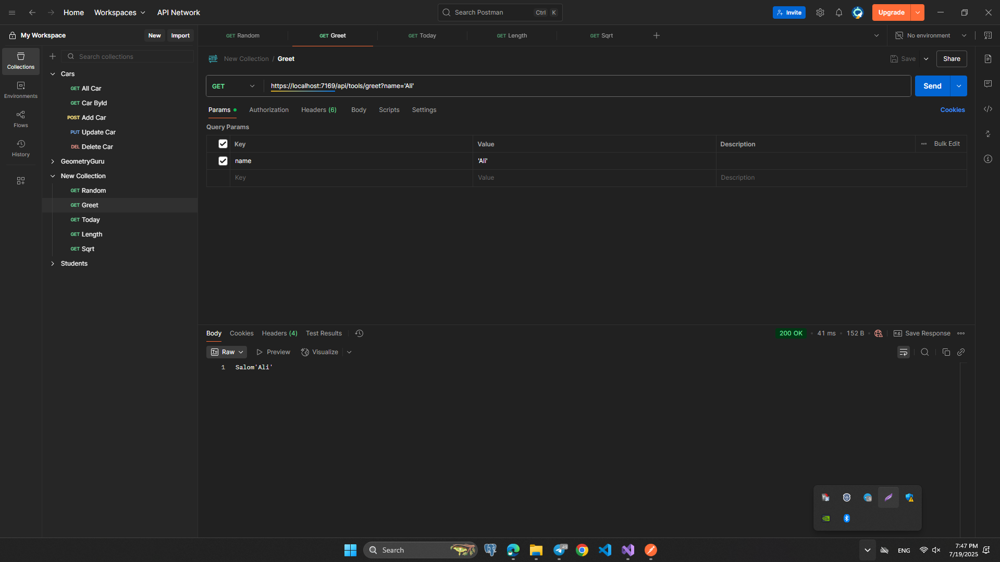
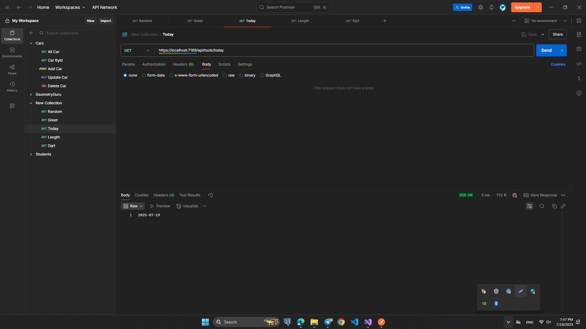
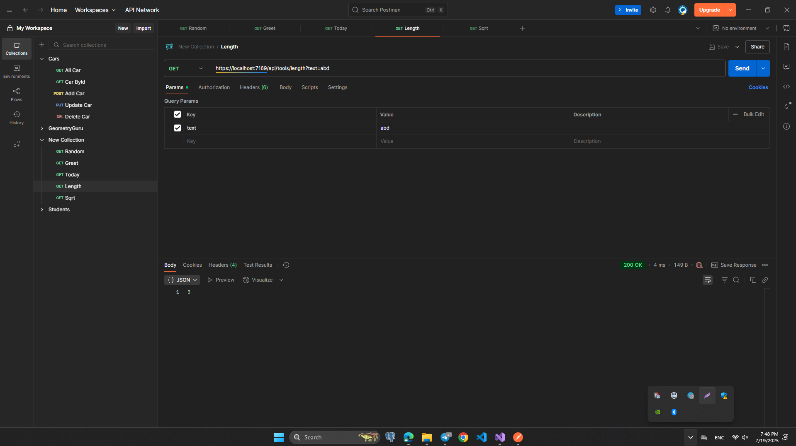
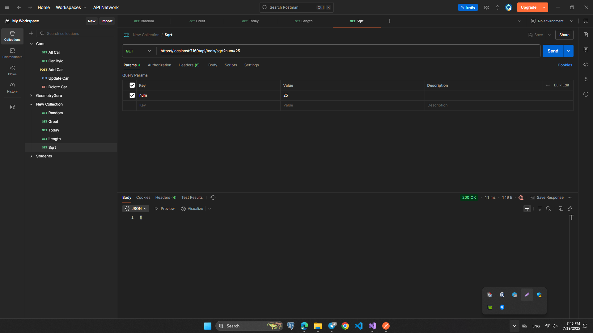

# HomeWork 5: Exam

# Fayl va Kataloglar bilan ishlash:

# Controller va Asinxronlik:

## `GET /api/tools/random`

- 0 dan 100 gacha bo‘lgan tasodifiy raqamni qaytaring.

## `GET /api/tools/greet?name=Ali`

- 2 soniya kutib, 'Salom, Ali' deb qaytaring (async).

## `GET /api/tools/today`

- Bugungi sanani yyyy-MM-dd formatida qaytaring.

## `GET /api/tools/length?text=Salom`

- Matn uzunligini qaytaring.

## `GET /api/tools/sqrt?value=81`

- Kvadrat ildizini hisoblang (Math.Sqrt).

