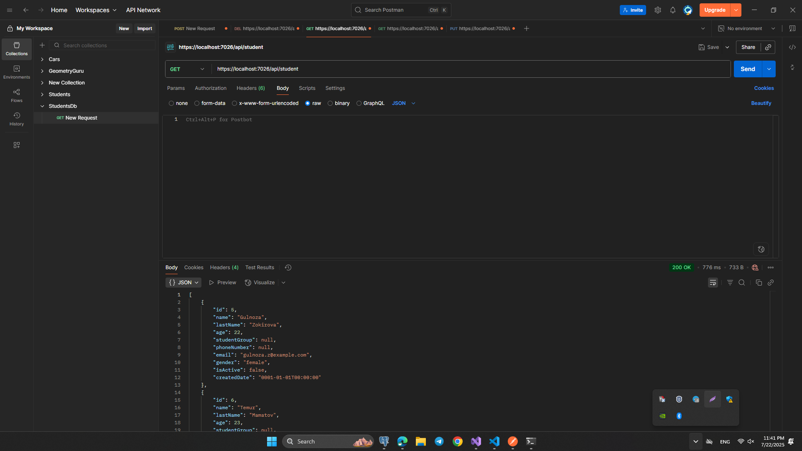
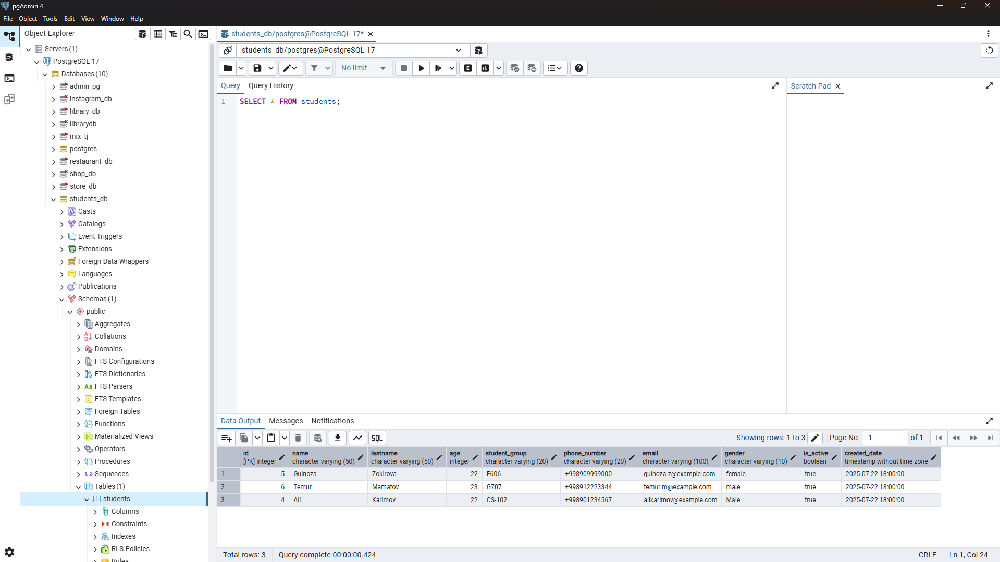
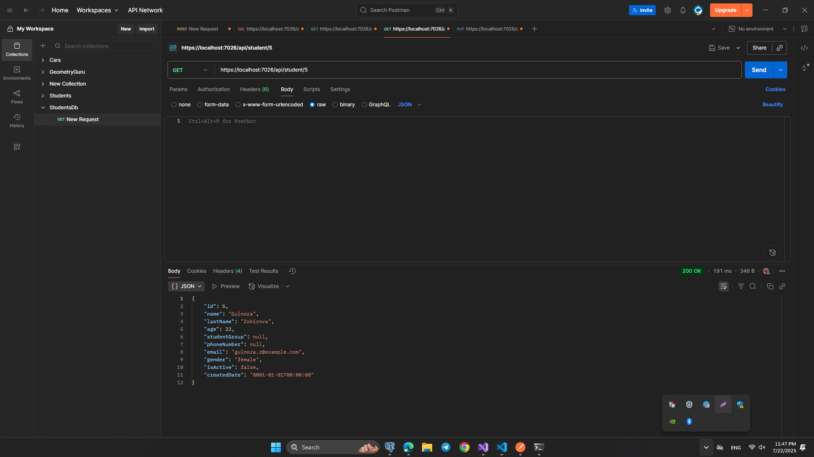
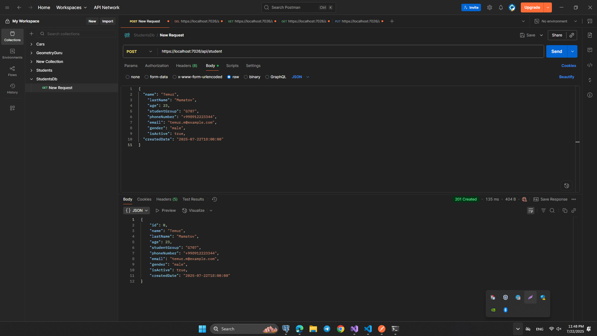
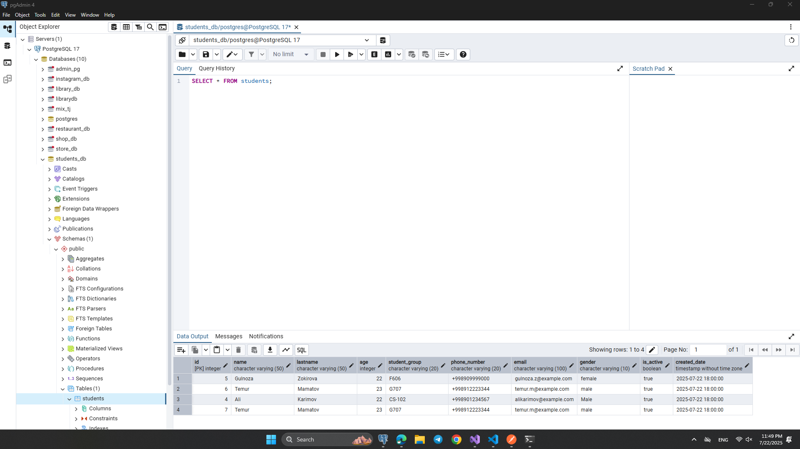
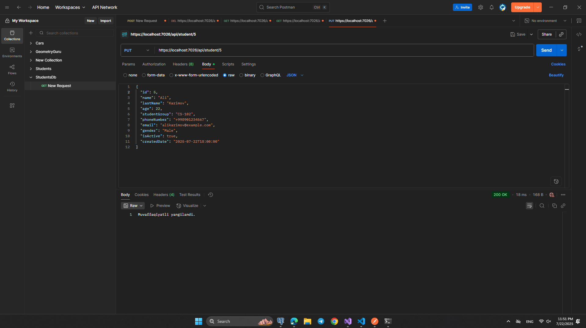
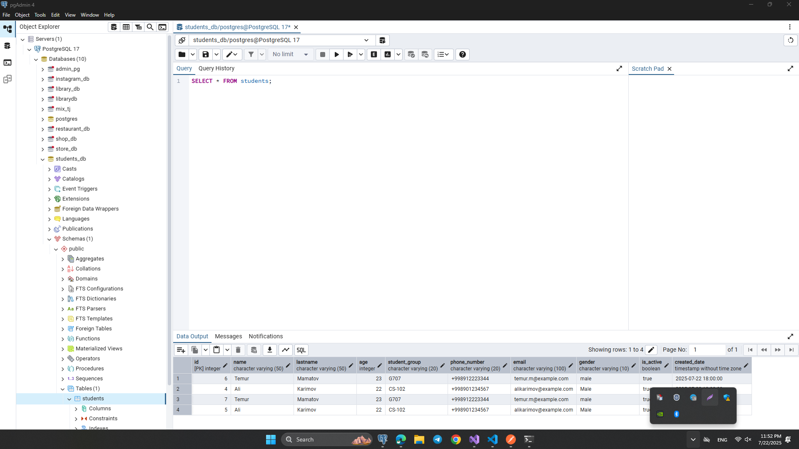
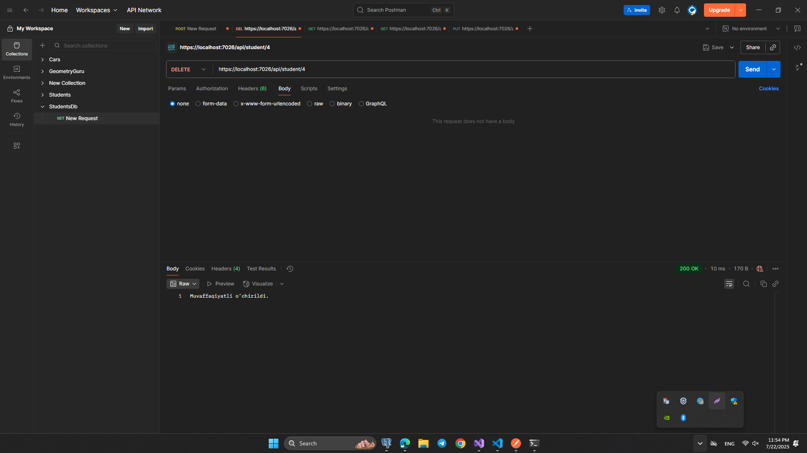
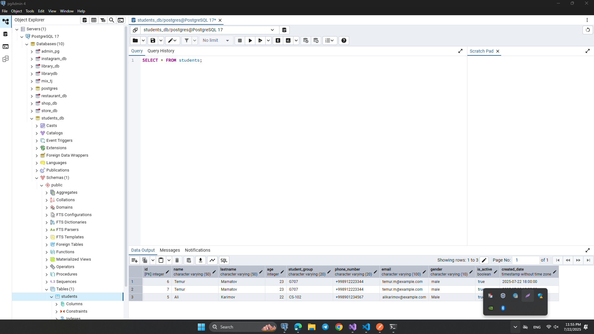

# HomeWork 6: StudentsApi

## ASP.NET Core Web API loyiha: Talabalar bilan ishlash tizimi (C#, Dapper, PostgreSQL)

## Loyihaning imkoniyatlari:

- Talabalarni ro‘yxatini olish (GET /api/student)
- ID bo‘yicha bitta talabani olish (GET /api/student/{id})
- Yangi talaba qo‘shish (POST /api/student)
- Talaba ma’lumotlarini tahrirlash (PUT /api/student/{id})
- Talabani o‘chirish (DELETE /api/student/{id})

## Texnologiyalar

- `ASP.NET Core Web API`
- `Dapper`
- `PostgreSQL` – ma’lumotlar bazasi
- `Postman` – API ni test qilish uchun

## students jadval tuzilmasi (PostgreSQL)

```sql
CREATE TABLE students (
	id SERIAL PRIMARY KEY,
	name VARCHAR(50) NOT NULL,
	lastname VARCHAR(50) NOT NULL,
	age INT NOT NULL,
	student_group VARCHAR(20) NOT NULL,
	phone_number VARCHAR(20),
	email VARCHAR(100),
	gender VARCHAR(10),
	is_active BOOLEAN DEFAULT TRUE,
	created_date TIMESTAMP DEFAULT NOW()
);
```

## Konfiguratsiya:

- "ConnectionStrings": {
  "DefaultConnection": "Host=localhost;Port=5432;Database=your_db_name;Username=your_username;Password=your_password"
  }

## Program.cs faylga:

builder.Services.AddSingleton<DapperContext>();
builder.Services.AddScoped<IStudentRepository, StudentRepository>();

## Rasmlar:

### `https://localhost:7026/api/student`





### `https://localhost:7026/api/student/5`



### `https://localhost:7026/api/student`





### `https://localhost:7026/api/student/5`





### `https://localhost:7026/api/student/4`




